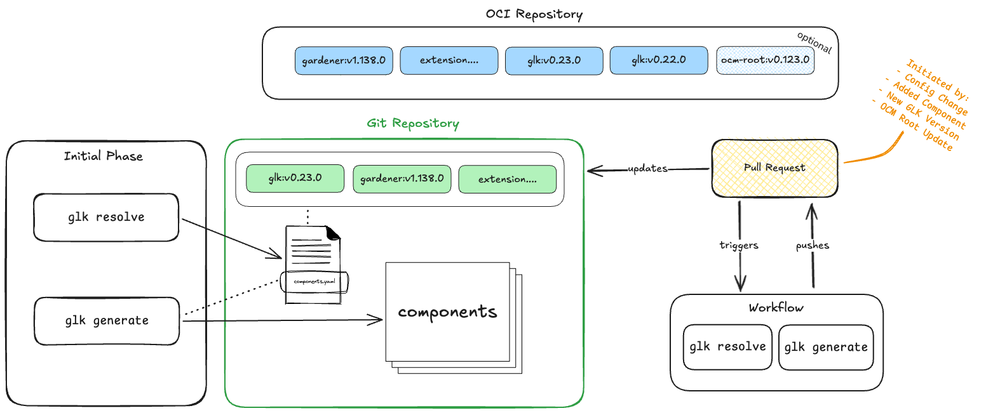

# GLK Integration

This document describes how the Gardener Landscape Kit (GLK) integrates into landscape management workflows, from initial setup to ongoing automated operations.

## Overview

GLK usage typically follows two main phases:

1. **Initial Usage**: The first-time setup phase where GLK prepares the `base` and `landscape` directory structures and generates the necessary Kubernetes manifests.
2. **Deployment Lifecycle**: The ongoing operational phase where GLK operations run regularly in an automated fashion to keep landscape manifests up-to-date.



## Initial Usage

The initial usage phase is typically executed on a local operator machine to bootstrap a new landscape or migrate an existing one to the structures and concepts provided by GLK.

### First-Time Setup

When using GLK for the first time, operators need to:

1. **Prepare Repository Structure**: Set up the base and landscape repositories according to the [repository organization patterns](../usage/repositories.md).

2. **Generate Base Manifests**: Create the base directory structure and generate core manifests that are common across multiple landscapes:
   ```bash
   glk generate base -c config-file /path/to/base-repo
   ```

3. **Generate Landscape Manifests**: Create landscape-specific overlays that are merged with the base repository:
   ```bash
   glk generate landscape -c config-file /path/to/landscape-repo
   ```

### Use Cases for Initial Phase

- **Bootstrapping a new landscape**: Starting from scratch with a fresh Gardener landscape deployment.
- **Migrating an existing landscape**: Converting an existing landscape to use GLK's directory structures, Kustomize overlays, and Flux-based GitOps approach.

After the initial setup, the generated manifests can be committed to Git repositories and deployed using Flux.

## Deployment Lifecycle

Once the initial setup is complete, operators should integrate GLK into their regular operational workflow. Running GLK operations on a regular and automated basis ensures:

- New or updated manifests in GLK are rendered out
- Operator-changed configurations are processed by GLK
- Migration operations are triggered when needed
- The landscape stays in sync with component updates

### Workflow Integration

GLK is designed to be integrated into workflow engines that are tightly coupled with the Git repositories hosting `base` and `landscape` configurations. This allows the workflow to react automatically to changes introduced via pull requests or other means.

> [!IMPORTANT]
> Workflow automation engines (such as [GitHub Actions](https://github.com/features/actions) or [GitLab CI/CD](https://docs.gitlab.com/ci/)) should not be confused with [Flux](https://fluxcd.io/), which is the backing deployment engine for Gardener, extensions, and related configurations. Flux is responsible for continuously deploying manifests from Git to the Kubernetes cluster. In a production-grade setup, however, usually more automation is required around the landscape deployment. Many operational processes — such as testing, release workflows, validation jobs, and similar tasks — are better integrated with the version control system itself (i.e., the CI/CD platform) rather than running within Flux.

**Recommended workflow engines:**
- [GitHub Actions](https://github.com/features/actions)
- [GitLab CI/CD](https://docs.gitlab.com/ci/)
- Other Git-integrated CI/CD systems

> [!NOTE]
> GLK delivers best practices and examples based on [GitHub Actions](https://github.com/features/actions). Operators need to adapt them accordingly, based on the workflow engine in use.

#### Atomic Commits for Smooth Deployments

When integrating GLK into workflows, it is essential that changes to the repository that directly influence GLK's output are bundled and merged together atomically into the main or master branch. This atomic approach ensures a smooth rollout of changes to the landscapes through Flux.

**Why atomic commits matter:**
- **Consistency**: Configuration changes and their corresponding generated manifests are committed together in a single merge
- **Avoid intermediate states**: Merging commits in stages (e.g., configuration first, then generated manifests separately) can cause interruptions in the landscape rollout process
- **Flux synchronization**: Flux pulls from the main branch and applies manifests; if commits are split, Flux might apply an inconsistent state during the transition

### GLK Operations and Triggers

GLK operations should be triggered based on specific events in the repository lifecycle. The timing and frequency of these operations are heavily tied to organizational processes, which is why GLK itself doesn't make assumptions about when to run, but instead provides the commands and describes best practices.

#### OCM Component Resolution (optional): `gardener-landscape-kit resolve ocm`

**Purpose**: Extracts component versions and image vector overwrites from OCM component descriptors and writes them to `components.yaml`.

**When to trigger**:
- Version update of root component descriptor
- A new GLK version is rolled out
- Additional components are added to the landscape

**Why it matters**: The `resolve ocm` command reads OCM component descriptors and extracts critical information like versions and image overwrites. This data is then used by subsequent `generate` commands to render manifests with the correct versions and configurations. See [Components](components.md) for details on the extracted data structure.

#### Base Generation: `gardener-landscape-kit generate base`

**Purpose**: Generates core landscape manifests that are common across multiple landscapes.

**When to trigger**:
- A new GLK version is rolled out
- Base repository manifests are changed
- Component versions in `components.yaml` are updated
- Base configuration files are modified

**Impact**: Changes to base manifests will eventually affect all landscapes that reference this base.

#### Landscape Generation: `gardener-landscape-kit generate landscape`

**Purpose**: Generates landscape-specific manifest overlays that are merged with base manifests.

**When to trigger**:
- A new GLK version is rolled out
- Landscape-specific manifests are changed
- Landscape configuration is modified
- Component versions in `components.yaml` are updated
- The referenced base repository is updated (e.g., Git submodule update - see [Repositories](../usage/repositories.md))

**Impact**: Changes affect only the specific landscape being generated.

### GitHub Actions Integration

GLK provides reusable GitHub Actions and workflows to facilitate automation:

#### Reusable Workflow: `.github/workflows/glk.yaml`

This workflow can be called from other workflows to execute GLK commands in a pull request context. It:
- Checks out the PR branch
- Runs specified GLK commands
- Commits any changes back to the PR branch

**Example usage in a repository workflow**:

```yaml
name: GLK Generate on PR
on:
  pull_request:

jobs:
  generate:
    uses: gardener/gardener-landscape-kit/.github/workflows/glk.yaml@main
    with:
      components-file: landscape/components.yaml
      glk-commands: |
        generate base -c landscape/glk.yaml ./base
        generate landscape -c landscape/glk.yaml .
      commit-message: 'chore: run gardener-landscape-kit'
```

#### GitHub Action: `.github/actions/glk/action.yaml`

This composite action runs GLK commands using the container image version specified in `components.yaml`. It can be used directly in workflow steps.

**Example usage**:

```yaml
steps:
  - name: Checkout
    uses: actions/checkout@v6
  
  - name: Run GLK
    uses: gardener/gardener-landscape-kit/.github/actions/glk@main
    with:
      components-file: landscape/components.yaml
      commands: |
        resolve ocm -c landscape/glk.yaml .
        generate landscape -c landscape/glk.yaml .
```

### Automation Patterns

Different organizational processes require different trigger patterns. Here are recommended approaches:

#### Pattern 1: Automatic Regeneration on Configuration Changes

Trigger GLK generation whenever configuration files or manifests are modified in a pull request:

```yaml
on:
  pull_request:
    paths:
      - 'base/**'
      - 'landscape/**'
      - '*.yaml'
```

**Benefits**: Ensures that manifest changes are always accompanied by properly generated outputs.

**Considerations**: The generated changes are appended to the PR, allowing reviewers to see the full impact of configuration changes before merging.

#### Pattern 2: Scheduled Component Resolution

Run `resolve ocm` on a schedule to check for new component versions:

```yaml
on:
  schedule:
    - cron: '0 6 * * 1'  # Weekly on Monday at 6 AM
  workflow_dispatch:     # Allow manual triggers
```

**Benefits**: Keeps landscape components up-to-date with the latest published versions.

**Considerations**: May require additional approval workflows for production landscapes.

> [!NOTE]
> A push based trigger for `resolve ocm` is likewise possible and may be desired in some cases. If your workflow engine doesn't support triggers for updated OCI image versions, you might consider using Flux's [Image Update Automation](https://fluxcd.io/flux/components/image/imageupdateautomations/).

#### Pattern 3: Base Graduation Workflow

For organizations using multiple landscape stages (`Development` → `QA` → `Production`), implement a graduation workflow:

1. Changes are made to the `base` repository
2. GLK generates updated manifests
3. `Development` landscape references the new base commit
4. After validation, `QA` landscape updates its base reference
5. After validation, `Production` landscape updates its base reference

See [Repository Organization](../usage/repositories.md#organization) for more details on base graduation.

#### Pattern 4: GLK Version Update

When a new GLK version is released with new features or templates:

1. Update the GLK version in `components.yaml`
2. Triggered workflow invokes `generate` commands to regenerate all manifests
3. Review generated changes in a pull request
4. Merge after validation

### Best Practices

1. **Always commit generated changes**: Generated manifests should be committed to Git alongside configuration changes. This provides:
   - Full audit trail of what was generated and when
   - Ability to review generated output before deployment
   - Rollback capability if issues are detected

2. **Use pull request workflows**: Run GLK commands in PR context and append results to the PR:
   - Provides visibility into what will change
   - Enables code review of generated manifests
   - Atomic rollout of changes to the landscape upon merge

3. **Separate resolution and generation**: Run `resolve ocm` before `generate` commands to ensure component data is current:
   ```bash
   glk resolve ocm -c landscape/glk.yaml .
   glk generate base -c landscape/glk.yaml ./base
   glk generate landscape -c landscape/glk.yaml .
   ```

4. **Test in lower environments first**: For multi-stage landscapes, validate generated changes in development and staging before applying to production.

5. **Document organization-specific triggers**: Since GLK doesn't prescribe when to run operations, document your organization's specific triggers and workflows.

## Summary

GLK integration consists of:

1. **Initial Setup**: One-time bootstrapping or migration on a local machine
2. **Workflow Integration**: Embedding GLK into CI/CD pipelines tied to Git repositories
3. **Automated Operations**: Running `resolve ocm` and `generate` commands based on organizational triggers
4. **Continuous Deployment**: Flux automatically applies generated manifests from Git

By integrating GLK into an automated workflow, operators ensure that landscapes remain consistent, up-to-date, and auditable while reducing manual operational overhead.
