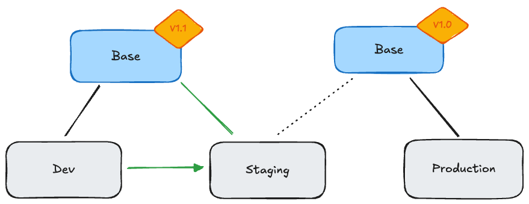

# Repositories

Git repositories are an essential part for landscape and configuration management. In essence, the landscape kit differentiates between two types of repositories:
- **Base Repository**: This repository contains the core landscape configurations, modules, and shared resources that are common across multiple landscapes.
- **Landscape Repository**: These repositories are specific to individual landscapes and typically contain overlay configurations that are merged with the ones found in the base repository.

Also see the Kustomize [base and overlay documentation](https://kubernetes.io/docs/tasks/manage-kubernetes-objects/kustomization/#bases-and-overlays) for more information.

Technically, the Gardener Landscape Kit doesn't use Git directly, but prepares and operates on the directory structure of the local filesystem, that can later be checked in and committed via Git by the user.

## Organization

Whenever Gardener Landscape Kit generates landscape assets, it must have access to both the base repository and the landscape repository. This requirement also applies to the Flux deployment system.
The separation of base and landscape repositories not only allows for a better modularization, but also helps to test changes, like version updates, through different landscape stages (e.g. `development`, `staging`, `production`).



To facilitate this, a reference from the landscape repository to the base repository is necessary. This reference can be organized in three different ways:

### Monorepo

> [!NOTE]
> A monorepo is not recommended for production usage.

Both the base repository (directories) and landscape repository (directories) are maintained within a single Git repository. The landscape repository contains the base repository as a subdirectory.

### Separate Repositories (Submodule)
The base repository and landscape repository are maintained as two distinct Git repositories. The landscape repository includes a reference to the base repository through a Git submodule.
In a setup with multiple landscape stages (e.g. `development`, `staging`, `production`), each stage can reference a different commit, branch, or tag of the base repository through its submodule configuration.
This way, changes in the base repository can graduate through the different landscape stages before being applied to production.

### Separate Repositories (Flux Repos)
The base repository and landscape repository are maintained as two distinct Git repositories. The landscape repository does not include a direct reference to the base repository.
Instead, both repositories are referenced in a Flux [`GitRepository`](https://fluxcd.io/flux/components/source/gitrepositories/) configuration.
Changes in the base repository would be tested through the landscapes by adjusting the `ref` field in the base repository's `GitRepository` resource.

> [!NOTE]
> The `include` configuration for the `GitRepository` is not generated by GLK and must be created manually.

```yaml
apiVersion: source.toolkit.fluxcd.io/v1
kind: GitRepository
metadata:
  name: base-repo
  namespace: flux-system
spec:
  url: https://github.com/<org>/<base-repo>
  ref:
    tag: v1.0.0
---
apiVersion: source.toolkit.fluxcd.io/v1
kind: GitRepository
metadata:
  name: landscape-repo
spec:
  ref:
    branch: main
  url: https://github.com/<org>/<landscape-repo>
  include:
    - repository:
        name: base-repo
      fromPath: components
      toPath: base/components
```

## Generation

The repository layout must be considered when executing GLK's `generate` command.
Generating the base repository is as simple as providing the path to the base repository directory, e.g.:

```bash
glk generate base -c config-file /path/to/base-repo
```

Whereas the generation of the landscape repositories requires the config to contain base and landscape paths, relative to the repository:

```yaml
apiVersion: landscape.config.gardener.cloud/v1alpha1
kind: LandscapeKitConfiguration
git:
  url: https://github.tools.sap/d066080/test-landscape-dev
  ref:
    branch: main
  paths:
    base: ./base
    landscape: ./
```

```bash
glk generate landscape -c config-file /path/to/landscape-repo
```

In the example above, the landscape repository is located in `/path/to/landscape-repo` and the base repository is in a subdirectory `/path/to/landscape-repo/base` of the landscape repository.
